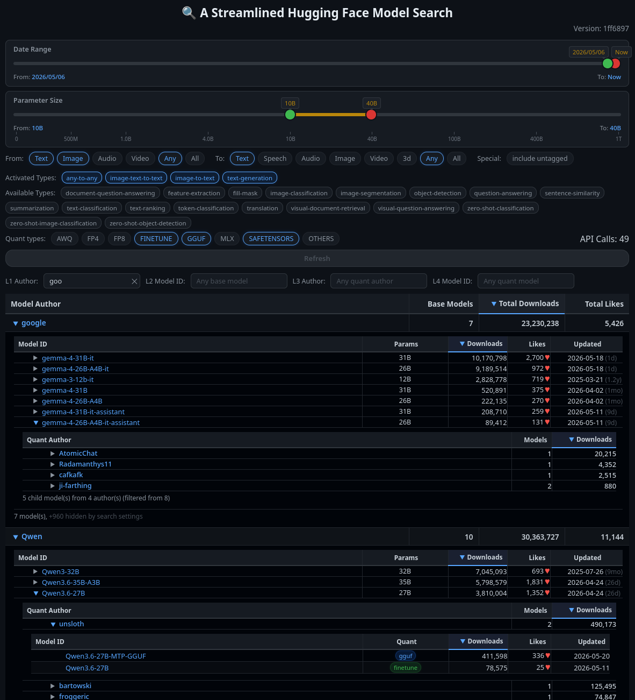

# A Streamlined Hugging Face Model Search

A dark-color themed, browser-based, 4-level hierarchical explorer for HuggingFace base models and their quantizations.

**Key Features:**
- No server. No install steps. Just open the `streamlined-hf-model-search.html` file in your browser.
- Uses the public HuggingFace Hub API (`https://huggingface.co/api/models`).
- No API key required.
- All API calls are rate-limited to be gentle on the Hugging Face server.

## Example Output

## Feature specifics

### Tiered Output Structure

Select your search criteria and click **Get Quick Results** or **Get Deep Results**.  A four tier model navigation tree is presented:

**Get Quick Results** - fetches top models per pipeline tag; skips cross-author base model injection for speed.

**Get Deep Results** - same as Quick, plus resolves cross-author base models referenced by quantizations via individual API calls.
Using Get Deep Results is slower but surfaces more quantizations.

| Level | Role | What You See | Sortable By |
|-------|------|-------|-------------|
| **1** | **Base Model Authors** | Organizations with base models matching all active filters | Model Author, Base Models, Total Downloads, Total Likes |
| **2** | **Base Author Models** | Individual base models by that author | Model ID, Params, Updated, Downloads, Likes |
| **3** | **Derivative Authors** | Who made derivative models, grouped by author | Author, Models, Downloads |
| **4** | **Derivative Models** | Derivative quantized/finetuned models with method badges | Model ID, Quant, Downloads, Likes, Updated |

### Dual-Range Sliders

Two sliders let you filter by **date** and **parameter size**.  Live tool-tips show what has been selected.

Selection knobs have a minimum gap with bi-directional pushing.

**Date:**
- Left Most Position = *Anytime*
- Middle Positions are in 14-day increments prior to *Now*
- Right-most position = *Now*

**Parameter size:**
- Select from 0B to >1T parameters via piecewise linear mapping across 7 zoom segments.

### Filter Bars

Three *Type* filter bars control which pipeline tags are active.
**From PipeLine Classes**, **To PipeLine Classes**, and **Untagged PipeLines** are used to quickly activate broad categories of pipeline tags.
The user may then selectively activate/deactivate individual tags in the **Activated Pipeline Tags** bar to refine their choices.
Tags not yet activated appear in the **Available Pipeline Tags** bar below for quick selection.

It should be noted that *Any* refers to the specific modality with the name *any* and is not intended to activate all modalities.
The *All* activation chip is used for quickly activating all modalities.

- **From PipeLine Classes:** input modality (text, image, audio, video, any, all)
- **To PipeLine Classes:** output modality (text, speech, audio, image, video, 3d, any, all)
- **Untagged PipeLines:** toggles like "include untagged" (models with no pipeline tag)

Below the filter bars is a scope notice explaining coverage limits and linking to HF Search for full model discovery.

### Quantization Filter Selection

The **Quant Types** chip bar lets you toggle popular quant type categories on/off:
- AWQ
- Finetune
- FP4
- FP8 
- GGUF
- MLX
- Safe Tensors
- Others — whatever doesn't match the above (GPTQ, EETQ, AQLM, EXL2, Marlin, BNB, INT8, INT4, Q8, Q4)

Quant method detection checks both model name and tags for known keywords.
When a model ID contains multiple quant keywords, all are displayed in the badge.
Fine-tunes (cross-author models derived from a base) are labeled "finetune" with a green badge.

### Output Display Filters

Above the displayed results are 4 text boxes which may be used to selectively filter the output. Each has a clear button (✕) for quick reset.

The *L1 Author* box pins matching Base Model Authors to the top of the hierarchical tree rather than hiding non-matching authors.

The *L2 Model ID*, *L3 Author*, and *L4 Model ID* filters act as global search terms that cascade through the hierarchy.
For example, typing a model name in the *L2 Model ID* box will narrow base models across all authors.
This will in turn update the list of displayed L1 authors to reflect only those with matching models.
This intentional behavior lets you quickly find specific models regardless of which author hosts them.
The L3 and L4 filters apply at their respective expansion levels within already-expanded sections.

### Hidden Models Preview Popups

When the *L2 Model ID* or *L4 Model ID* filter hides models, a hidden count link appears below each affected table (e.g., "+12 hidden by search settings").
Hovering over this link opens a **Hidden Models Preview** popup showing all filtered-out models in a scrollable table.

The popup displays:
- **Model ID** - clickable link to the HuggingFace model page
- **Params** - parameter count (resolved from cache; em-dash if unknown)
- **Quant** - detected quant method, or "SAFE TENSOR" when no quant keyword is found in the name
- **Tag** - pipeline tag for the model
- **Updated** - last modification date (YYYY-MM-DD format)

By default the hidden model list is sorted by Updated date descending (most recent first), but the user may sort by any column as desired.

The popup features:
- Sticky header ("Hidden Models Preview"), sticky column headers, and a persistent footer showing total hidden count
- Center-positioned over the trigger link with viewport boundary clamping
- 200ms hover delay to prevent flicker on accidental mouse passes
- Stays visible when hovering into the popup so links are clickable
- Resets scroll position to top each time it opens

### Additional Result Table Features

- **Column sorting** - Available at every level by clicking the column headers
- **Expandable rows** - Click on any row (excluding the link) to expand
- **Cached results** - Re-expanding is instant; task fetches are skipped once complete; stale-generation renders are discarded
- **Parameter deepening** - Models with unknown parameter counts are fetched when rows are opened and results are updated in real time (if available)
- **Infer Missing Params chip** - When enabled then models with unknown params search their children to deduce the parent's parameter count via API. Uses name-based Base Model ID regex first, then searches children (2 API calls per model), then fetches individual child cards (up to 10; stops early after 3 agreeing results)
- **Hide Missing Params chip** - When enabled, models without a known parameter count are hidden from L1 and L2 entirely
- **API call counter** - displays total requests made in the session; hover for rate-limit info; flashes amber during active rate limiting (3+ consecutive 429s)
- **Clear Cache button** - empties all in-memory caches (param cache, LRU model cache, inflight state, inference tracking) while preserving filters, sliders. Collapses expanded sections - re-expand to reload from API
- **Quant badges** - color-coded by method (FP4, FP8, AWQ, GGUF, MLX, etc.); all detected methods shown; orphan quants get a yellow badge
- **Debug bar** - "Dump of all Fetched Models" chip shows raw `_allFetched` data to verify if a model was fetched before filter/suppression logic hides it

## Caveats

By necessity of being kind to the Hugging Face API end-point, author and model results are *NOT* exhaustively complete.
The utility does have generous limits for the number of models it will pull though.

For obscure or old models with minimal visibility or active use, then such models may be left out of the search results.
Additionally many authors don't tag their model metadata properly which can also lead to them not getting pulled down in the results.

In order to expose such authors would require hammering the HuggingFace API quite heavily which is bad practise.

As a result, if you know the name of a specific author/model that you're looking for, then just use the regular Hugging Face Search Page and look them up there.

## Browser Requirements

Modern browser with ES2020+ support (Chrome 90+, Firefox 90+, Safari 14+).

## Future Ideas

- Export results to CSV
- Bookmarkable state (URL params for filters)
- Model architecture tags in L2
- Trending / likes-per-day metrics
